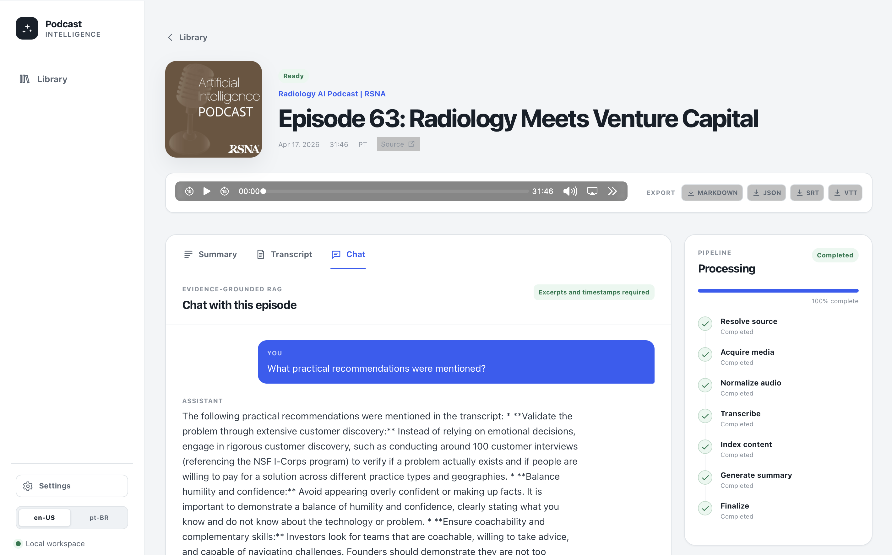

# Podcast Intelligence Desktop

Podcast Intelligence imports podcast episodes or local audio/video, normalizes
media, transcribes speech, creates timestamp-grounded summaries, indexes
speaker-aware chunks, and answers questions with citations that seek directly
to the source audio.

This repository now has a **desktop-first architecture** that can be packaged as
native applications for macOS and Windows. The original Docker/server deployment
remains available for multi-process or networked use.

## What is included

- local file upload and direct media URL import;
- RSS, Apple Podcasts, and Spotify-to-public-RSS resolution;
- guarded remote downloads with redirect, DNS, MIME, and size validation;
- FFmpeg normalization to processing WAV and playback M4A;
- published VTT, SRT, and segmented JSON transcript reuse;
- demo, OpenAI-compatible, streaming WebSocket STT, and Codex CLI providers;
- optional diarized transcription when the selected provider supports it;
- speaker renaming and confirmation;
- structured hierarchical summaries tied to transcript segment IDs;
- hybrid lexical/vector retrieval;
- grounded chat with materialized timestamp citations;
- JSON, Markdown, SRT, and VTT exports through a native save dialog;
- English and Brazilian Portuguese interface;
- local streamable-HTTP MCP tools for Codex/ChatGPT-compatible clients;
- resumable, idempotent processing jobs that survive application restarts.



## Desktop architecture

```text
Tauri window (Rust)
        │
        ├── React 19 + Vite interface
        │
        ├── random loopback session token
        │
        └── packaged Python engine sidecar
                 │
                 ├── FastAPI contracts and existing domain services
                 ├── durable in-process worker pool
                 ├── SQLite + JSON vectors
                 ├── private local object store
                 ├── FFmpeg / FFprobe sidecars
                 └── optional MCP sidecar process
```

The migration deliberately keeps the mature Python ingestion, provider,
transcript, summary, retrieval, citation, and export logic. Tauri supplies the
native lifecycle, window, application-data directory, dialogs, external-link
handling, and installer. This avoids replacing validated AI/media behavior with
a second implementation solely for packaging.

### Infrastructure mapping

| Original server component | Desktop replacement |
|---|---|
| Next.js server | React/Vite assets embedded in Tauri |
| PostgreSQL + pgvector | SQLite; vectors stored as JSON and scored locally |
| Redis + Celery worker/beat | bounded in-process executor with durable SQLite outbox |
| MinIO/S3 | signed local filesystem adapter under the app data directory |
| fixed API/MCP ports | random loopback API port; MCP prefers 8001 and falls back when occupied |
| browser downloads | authenticated fetch followed by native save dialog |
| `.env`-only provider setup | in-app provider settings and engine restart |

The Docker deployment still uses PostgreSQL/pgvector, Redis/Celery, MinIO, and
the same FastAPI domain layer.

## Build a native application

Native bundles must be built on the target operating system. The repository
also includes a GitHub Actions matrix that builds both macOS architectures and
Windows x64.

### macOS

Requirements:

- macOS with Xcode Command Line Tools;
- Python 3.12;
- [uv](https://docs.astral.sh/uv/);
- Node.js 22 and npm;
- stable Rust toolchain with Cargo.

```bash
./scripts/build-desktop.sh
```

On Apple Silicon the default target is `aarch64-apple-darwin`; on an Intel Mac
it is `x86_64-apple-darwin`. To choose explicitly:

```bash
./scripts/build-desktop.sh aarch64-apple-darwin
```

Tauri writes the native artifacts below:

```text
frontend/src-tauri/target/<target>/release/bundle/
```

Depending on the installed Tauri bundlers, this includes a `.app` and `.dmg`.
The generated application is unsigned unless signing/notarization credentials
are configured.

### Windows

Requirements:

- Windows 10/11 x64;
- Visual Studio 2022 Build Tools with Desktop development with C++;
- Python 3.12;
- uv;
- Node.js 22 and npm;
- stable Rust MSVC toolchain;
- WebView2 Runtime, normally already present on supported Windows systems.

From PowerShell:

```powershell
Set-ExecutionPolicy -Scope Process Bypass
.\scripts\build-desktop.ps1
```

The default target is `x86_64-pc-windows-msvc`. Tauri writes installers below:

```text
frontend\src-tauri\target\x86_64-pc-windows-msvc\release\bundle\
```

### GitHub Actions

Push a tag such as `v0.2.0`, or run **Build desktop installers** manually. The
workflow in `.github/workflows/build-desktop.yml` creates separate artifacts
for:

- macOS Apple Silicon;
- macOS Intel;
- Windows x64.

The workflow downloads a pinned FFmpeg/FFprobe release, records SHA-256 values,
verifies the upstream digest when the release API provides one, builds the
PyInstaller engine, stages Tauri sidecars, runs source validation, and builds
native bundles.

See [Desktop packaging](docs/desktop-packaging.md) for signing, sidecar naming,
FFmpeg licensing, and CI details.

## First run

The application starts in the credential-free **Demo** profile. It exercises
storage, processing, indexing, summaries, search, chat, and exports, but a real
import receives a synthetic transcript clearly marked as demo content.

Open **Settings** in the application to choose:

- the complete OpenAI-compatible profile;
- a custom combination of transcription, embedding, and LLM providers;
- separate credentials per provider;
- Responses API or Chat Completions for structured generation;
- a PCM WebSocket transcription endpoint;
- local Codex CLI for LLM operations;
- Spotify credentials;
- embedding dimensions, batching, retrieval weights, and worker count.

Saving settings restarts only the local engine. SQLite, audio, transcripts,
summaries, and queued jobs remain intact. If invalid provider settings prevent
startup, the recovery screen can reset providers to Demo without deleting data.

## Local data and backups

Tauri selects the operating system's standard private application-data
directory for the identifier `com.thalesmms.podcast-intelligence`. The exact
path is shown to the frontend at runtime and contains:

```text
settings.json                    provider configuration and credentials
engine-secret                    HMAC secret for local media links
podcast-intelligence.sqlite3     metadata, transcripts, chunks and summaries
objects/                         originals, normalized audio and playback files
tmp/                             transient processing files
codex/                           trusted Codex CLI working directory
```

Back up the entire directory while the app is closed. Provider secrets are
currently stored in `settings.json`; Unix builds apply mode `0600`, while
Windows relies on the user's application-data ACL. This is not equivalent to an
OS keychain. See [Security](SECURITY.md).

## Server/Docker mode

The networked modular-monolith deployment remains supported:

```bash
cp .env.example .env
docker compose up --build
```

Services:

- web interface: `http://localhost:3000`;
- REST/OpenAPI: `http://localhost:8000/docs`;
- MCP: `http://localhost:8001/mcp`;
- MinIO console: `http://localhost:9001`.

The server frontend is now the same Vite application used by Tauri. Docker mode
retains PostgreSQL/pgvector ranking, Redis/Celery, and S3-compatible storage.

## Development

Desktop UI and Tauri host:

```bash
cd frontend
npm install
npm run tauri dev
```

Before `tauri dev`, stage compatible engine, FFmpeg, and FFprobe sidecars with
`backend/scripts/build_engine.py`, or run the complete desktop build script.

Server backend:

```bash
cd backend
uv sync --extra dev
uv run alembic upgrade head
uv run python -m podcast_intelligence.cli bootstrap
uv run uvicorn podcast_intelligence.main:app --reload
```

Frontend-only browser development:

```bash
cd frontend
npm install
npm run dev
```

## Validation

Full checks on a connected development machine:

```bash
make check
make desktop-check
```

The native GitHub Actions matrix repeats backend tests, frontend type checks and
tests, Rust formatting/checks, the PyInstaller build, and Tauri packaging on
each target OS. The work performed in this conversion environment is recorded
separately in [VALIDATION.md](VALIDATION.md).

## Documentation

- [Getting started](GETTING_STARTED.md)
- [Migration report](MIGRATION_REPORT.md)
- [Architecture](docs/architecture.md)
- [Desktop packaging](docs/desktop-packaging.md)
- [Deployment and operations](docs/deployment.md)
- [Data model](docs/data-model.md)
- [REST API](docs/api.md)
- [AI providers](docs/providers.md)
- [MCP and Codex](docs/mcp-and-codex.md)
- [Known limitations](docs/known-limitations.md)
- [Security](SECURITY.md)
- [Validation](VALIDATION.md)

## License and media tooling

Project code is Apache License 2.0. The packaged FFmpeg binaries are separate
third-party components. Their source metadata, upstream notices, and applicable
GPL text are copied into `frontend/src-tauri/third_party/ffmpeg/` during the
native build. Review those terms before redistribution.

Users are responsible for having authorization to process supplied content.
The software does not attempt to bypass DRM, subscriptions, or access controls.
